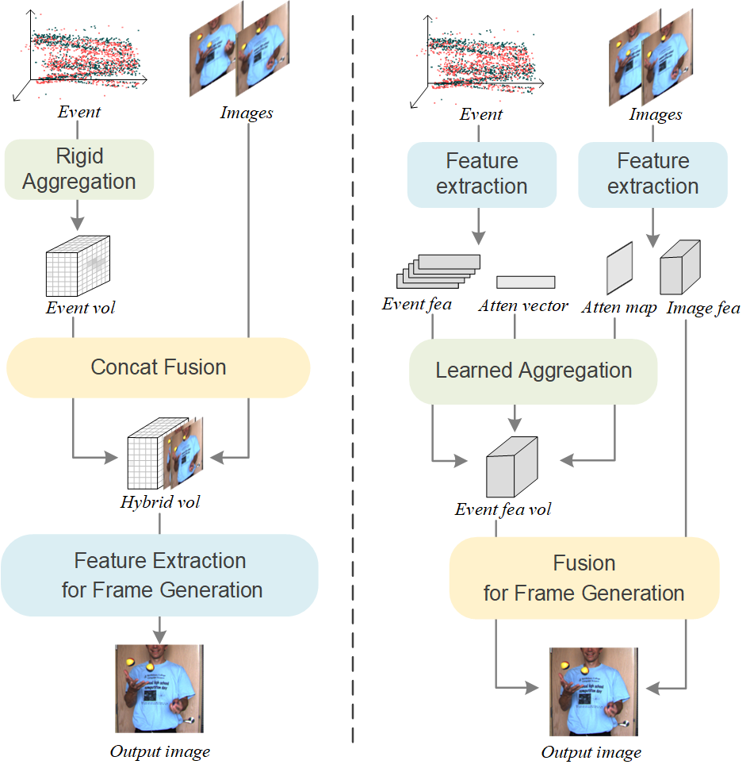
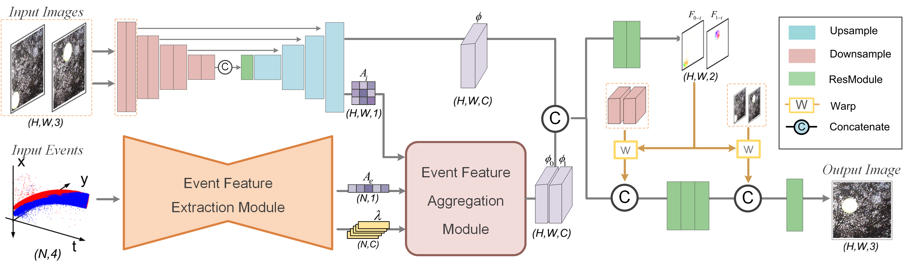

# PIFNet: A Point-Image Fusion Network for Event-based Frame Interpolation

The official implemention of PIFNet[[paper](https://ietresearch.onlinelibrary.wiley.com/doi/epdf/10.1049/cvi2.12220)]

## Dependencies

We used the following to train and test the model.

- Ubuntu 18.04
- Python==3.9.2
- numpy==1.19.2
- [PyTorch](http://pytorch.org/)==1.8.0, torchvision==0.6.0, cudatoolkit==10.1

## Arch

### Trained Models.
You can download the pretrained PIFNet models from the following links.

 **PreTrained model** [[Link](https://drive.google.com/file/d/19qVTcJLl6TjNjgtpcQwdnYAXEJaD0_F9/view?usp=sharing)]  on **Vimeo-90k** dataset.

 **FineTuned model** [[Link](https://drive.google.com/file/d/12iw9ShNLvEzai9TOQPwSK6uwCJYT02ko/view?usp=sharing)]  on **ESRGB** dataset.

## Results
You can download the frame interpolation result on **middlebury(other)** dataset through this [link](https://drive.google.com/drive/folders/1rzp3V1eLza9YW1IGp96Wq6sVAjPYUlLt?usp=sharing).
 

